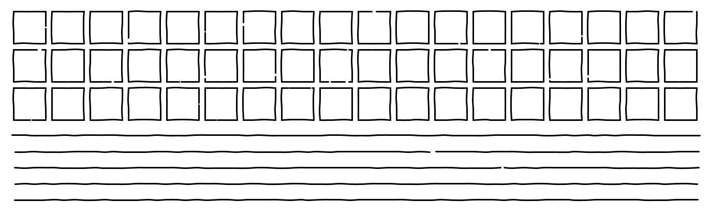

# line-wobbler

Generate wobbly hand-drawn lines in Processing.  
Save to SVG for clean pen plotter input.



## Getting Started

### 📺 [Video Walkthrough](https://youtu.be/eRmvj5s2-kU)

### Requirements

-   [Processing 4](https://processing.org/download/)
-   The [LazyGUI](https://github.com/KrabCode/LazyGui) library is required to run the `GuiControl` example sketch.

### Installation

Copy the `LineWobbler.pde` file from the [`src`](src/) folder into the folder for your Processing sketch.

### Example Sketch

1. Create an instance of the `LineWobbler` class with the path to your font.
2. Use `drawLine()` or other drawing functions to create graphics with wobbly lines.

```java
LineWobbler wob = new LineWobbler();

void setup() {
  size(300, 200);
}

void draw() {
  background(255);
  randomSeed(0);
  wob.drawLine(10, 20, 290, 20);
}

```

## Usage

### Instantiation

_LineWobbler_ **new LineWobbler**( [ _int_ frequency, _float_ amplitude, _float_ frequencyJitter ] )

Create an instance of the LineWobbler class.  
`frequency` sets the frequency of subpoints (in pixels).  
`amplitude` sets how much the subpoints can deviate from the line (in pixels).  
`frequencyJitter` sets how much the subpoints can deviate parallel to the line (as a percentage of of `frequency`)

### Drawing Lines

```java
LineWobbler wob = new LineWobbler();
wob.drawLine(10, 20, 290, 20);
```

_PVector[]_ **drawLine**( _float_ x1, _float_ y1, _float_ x2, _float_ y2 )

Draw a line between two points.  
Returns the array of subpoints used to render the wobbly line.

_PVector[]_ **drawBrokenLine**( _float_ x1, _float_ y1, _float_ x2, _float_ y2 )

Draw a broken line between two points.
Returns the array of subpoints used to render the wobbly line.

### Drawing Polylines

```java
LineWobbler wob = new LineWobbler();
PVector[] points = {
  new PVector(0, 0), new PVector(100, 100), new PVector(200, 0)
};
wob.drawPolyline(points);
```

_void_ **drawPolyline**( _PVector[]_ vertices, [ _boolean_ connectEnds ])

Draw a multi-segment line through an array of points.  
`connectEnds` specifies whether or not the last point in the line should be connected back to the first to form a closed shape.

_void_ **drawBrokenPolyline**( _PVector[]_ vertices, [ _boolean_ connectEnds ] )

Draw a broken multi-segment line through an array of points.  
`connectEnds` specifies whether or not the last point in the line should be connected back to the first to form a closed shape.

### Drawing Rectangles

```java
LineWobbler wob = new LineWobbler();
wob.drawRect(20, 180, 370, 100);
```

_void_ **drawRect**( _float_ x, _float_ y, _float_ w, _float_ h, [ _boolean_ connectCorners])

Draw a rectangle with the given dimensions.
`x` and `y` specify the top left corner of the rectangle. `w` and `h` set the width and height.  
`connectCorners` determines whether the four line segments should be joined at the corners.

_void_ **drawBrokenRect**( _float_ x, _float_ y, _float_ w, _float_ h, [ _boolean_ connectCorners])

Draw a rectangle with the given dimensions using broken lines.
`x` and `y` specify the top left corner of the rectangle. `w` and `h` set the width and height.  
`connectCorners` determines whether the four line segments should be joined at the corners.

### Drawing Circles

```java
LineWobbler wob = new LineWobbler();
wob.drawCircle(210, 400, 100);
```

_void_ **drawCircle**( _float_ x, _float_ y, _float_ r, [ _int_ numSegments ] )

Draw a circle with the given dimensions.
`x` and `y` specify the center of the circle. `r` sets the radius.  
Wobbly circles are rendered by breaking up the circle into many straight segments before adding subpoints. `numSegments` lets you specify how many segments should be used. In general, higher numbers of segments create smoother circles.

_void_ **drawBrokenCircle**( _float_ x, _float_ y, _float_ r, [ _int_ numSegments ])

Draw a with the given dimensions using a broken line.
`x` and `y` specify the center of the circle. `r` sets the radius.  
Wobbly circles are rendered by breaking up the circle into many straight segments before adding subpoints. `numSegments` lets you specify how many segments should be used. In general, higher numbers of segments create smoother circles.

### Drawing Shapes

```java
LineWobbler wob = new LineWobbler();
PShape shape = loadShape("complexShape.svg");
wob.drawShape(shape);
```

> [!NOTE]
> LineWobbler only extracts the shape's vertices and connects them with straight lines (no curves). Drawing shapes with large curves will most likely produce undesirable results unless those curves are first broken up by adding intermediate points.

_void_ **drawShape**( _PShape_ shape, [ _float_ x, _float_ y ] )

Draw a shape (such as a loaded SVG) with wobbly lines.

_void_ **drawBrokenShape**( _PShape_ shape, [ _float_ x, _float_ y ] )

Draw a shape (such as a loaded SVG) with wobbly broken lines.

### Properties

_int_ **frequency** = `10`

The distance between subpoints in pixels.  
Smaller values create a more jagged line, larger values create a smooth wobble.

_float_ **amplitude** = `0.5`

How much the subpoints can deviate from the line (in pixels).  
Larger values create a rougher line, smaller values make the line straighter.

_float_ **frequencyJitter** = `0.2`

How much the subpoints can deviate parallel to the line (as a percentage of frequency).  
A value of `0` creates equidistant subpoints. Larger values may cause subpoints to appear out of order, creating a line that doubles back on itself in places.

_boolean_ **wobbleEndPointAmplitude** = `true`

Whether or not to wobble the end point positions perpendicular to the line.

_boolean_ **wobbleEndPointPosition** = `true`

Whether or not to wobble the end point positions parallel to the line.

_boolean_ **drawGuides** = `false`

Whether or not to draw the guides (useful for debugging).  
When enabled, straight guide lines are drawn between points. Line vertices are highlighted with green dots and wobbly subpoints are drawn red.

_float_ **minBreakSize** = `0.2`

The minimum size of a break in a line (in pixels) when using the broken line drawing methods.

_float_ **maxBreakSize** = `5`

The maximum size of a break in a line (in pixels) when using the broken line drawing methods.

_float_ **minLineSegmentLength** = `5`

The minimum length of a broken line segment (in pixels).

_float_ **breakFrequency** = `0.2`

The frequency of breaks in a line when using the broken line drawing methods.

### Randomization

LineWobbler lines are recalculated with random values every frame. This will cause the lines to constantly move in sketches that utitlize a `draw()` loop. Calling the [`randomSeed()`](https://processing.org/reference/randomSeed_.html) function at the beginning of the draw loop will ensure that the same random values are used on each frame. Change the value sent to `randomSeed()` to calculate new random values.

### Animation

LineWobbler performs many unoptimized calculations on each frame. It is not meant to be used for animated sketches, and will most likely cause performance slowdowns if used for animations.

## Build from Source

The build script for this project (`build.sh`) simply copies the class from `src` into the example sketches in the `examples` folder.

```zsh
cd [line-wobbler]
./build.sh
```

## Support

This is a personal project and is mostly unsupported, but I'm happy to hear feedback or answer questions.

## License

This project is licensed under the Unlicense - see the [LICENSE](LICENSE) file for details.

---

👨🏻‍🦲❤️🛠
